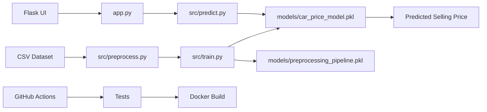

# Car Price Prediction

A production-ready machine learning web application that predicts the selling price of a used car from vehicle attributes such as car model, present price, kilometers driven, fuel type, seller type, transmission, owner count, and car age.

## Project Overview

This project demonstrates an end-to-end ML workflow suitable for a final-year engineering project and GitHub portfolio:

- Data loading from `data/car_data.csv`
- Feature engineering with `Car_Age = Current_Year - Year`
- Categorical encoding with `OneHotEncoder`
- Model training with `RandomForestRegressor`
- Evaluation using R2 Score, MAE, and RMSE
- Model and preprocessing artifact persistence with `joblib`
- Flask web interface with validation and error handling
- Pytest test suite
- Dockerized production runtime
- GitHub Actions CI/CD pipeline

## Architecture Diagram



## Project Structure

```text
Car_Price_Prediction/
├── data/
│   └── car_data.csv
├── notebooks/
│   └── EDA.ipynb
├── src/
│   ├── preprocess.py
│   ├── train.py
│   └── predict.py
├── models/
│   ├── car_price_model.pkl
│   ├── preprocessing_pipeline.pkl
│   └── metrics.json
├── templates/
│   └── index.html
├── static/
│   └── style.css
├── tests/
│   └── test_model.py
├── .github/
│   └── workflows/
│       └── ci-cd.yml
├── app.py
├── requirements.txt
├── Dockerfile
├── .gitignore
└── README.md
```

## Setup Instructions

```bash
python -m venv .venv
source .venv/bin/activate  # Windows: .venv\Scripts\activate
pip install --upgrade pip
pip install -r requirements.txt
```

## Train the Model

```bash
python -m src.train
```

The command saves:

- `models/car_price_model.pkl`
- `models/preprocessing_pipeline.pkl`
- `models/metrics.json`

## Local Run Instructions

```bash
python app.py
```

Open `http://localhost:5000` and submit the vehicle details to get the predicted selling price.

## Run Tests

```bash
pytest -q
```

## Docker Instructions

Build the image:

```bash
docker build -t car-price-prediction .
```

Run the container:

```bash
docker run -p 5000:5000 car-price-prediction
```

Open `http://localhost:5000`.

## CI/CD Explanation

The GitHub Actions workflow in `.github/workflows/ci-cd.yml` runs on pushes and pull requests to `main`.

Pipeline steps:

1. Checkout repository
2. Set up Python 3.11
3. Install dependencies
4. Run pytest
5. Verify model artifacts exist
6. Build Docker image

## Deployment Instructions

### Render

1. Push this repository to GitHub.
2. Create a new Render Web Service.
3. Select the repository.
4. Set environment to Docker.
5. Use port `5000`.
6. Deploy.

### Railway

1. Push the repository to GitHub.
2. Create a new Railway project from the repository.
3. Railway will detect the Dockerfile.
4. Set the service port to `5000` if required.
5. Deploy the service.

### Azure App Service

1. Create an Azure Container Registry or use Docker Hub.
2. Build and push the image:

```bash
docker build -t car-price-prediction .
docker tag car-price-prediction <registry>/car-price-prediction:latest
docker push <registry>/car-price-prediction:latest
```

3. Create an Azure App Service for Containers.
4. Select the pushed image.
5. Configure port `5000`.
6. Restart the app service.

## Screenshots Section

Add screenshots after running the Flask app locally:

- Home page form
- Successful prediction
- Validation error state

## Future Improvements

- Add model monitoring and drift detection
- Store training metadata with MLflow
- Add API endpoint for JSON predictions
- Add more algorithms and hyperparameter tuning
- Add cloud database storage for prediction history
- Deploy with HTTPS and custom domain

## File-by-File Explanation

- `data/car_data.csv`: Source dataset used by training.
- `notebooks/EDA.ipynb`: Notebook location for exploratory data analysis.
- `src/preprocess.py`: Validates schema, creates `Car_Age`, keeps `Car_Name` as a categorical model feature, drops unused year data, and builds the preprocessing pipeline.
- `src/train.py`: Trains the Random Forest model, evaluates it, and saves artifacts.
- `src/predict.py`: Loads the model, validates inputs, and returns predictions.
- `models/car_price_model.pkl`: Serialized full sklearn pipeline used by Flask and tests.
- `models/preprocessing_pipeline.pkl`: Serialized preprocessing transformer for reuse and inspection.
- `templates/index.html`: Flask/Jinja UI template.
- `static/style.css`: Responsive styling for the web interface.
- `tests/test_model.py`: Pytest coverage for model loading, prediction, and preprocessing.
- `.github/workflows/ci-cd.yml`: CI/CD workflow for tests, artifact checks, and Docker build.
- `app.py`: Flask application entry point.
- `requirements.txt`: Python dependencies.
- `Dockerfile`: Production container definition.
- `.gitignore`: Excludes local and generated development files.
